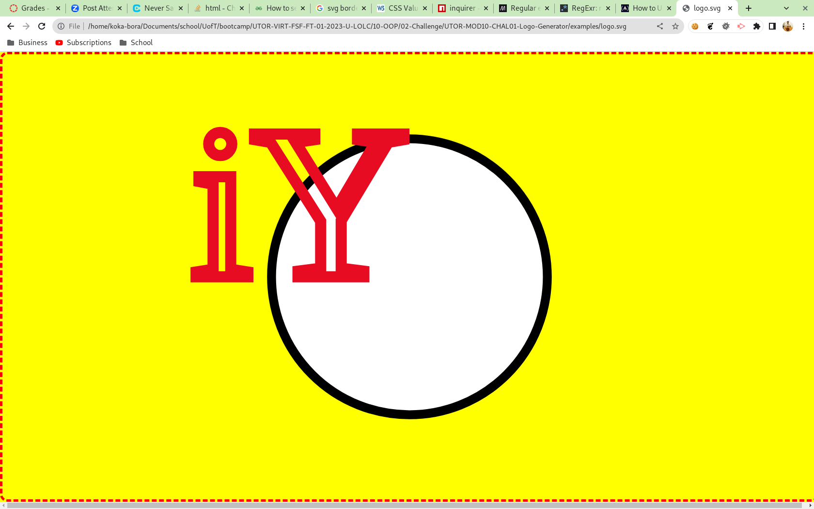

# UTOR-MOD10-CHAL01-Logo-Generator
University of Toronto - Module 10 - Challenge 01 - Logo Generator

## Description

Repository containing the code for the SVG logo generator. This is a server side project using node.js where the user is asked a series of questions. The questions focus on:
- SVG image styling: this is the overall image container. This includes background colour of the image, border colour, border style, border width and border radius.
- Shape type and styling: this is the shape within the image. The user can choose fom Triangle, Square, and Rectangle as well as their side width. The user is limited to the minimum dimension of the svg file which is 200.Styling is limited to fill (background colour), stroke (border colour), and stroke width (border width). 
- Text and styling: this is the three character text that appears on the logo. The styling is expanded to include items like font, font-size, text positioning from the origin, fill, stroke, and stroke width.

The origin is set as the middle point or centre of the image container. All shapes and text are centered based on that origin point. 

The application utilizes several test suites for each class created and used in making the SVG. The command line interface (cli) class is not tested due to the user input.

Below is the image of the application when the user enters input

Below is the image of the resulting svg file

## Table of Contents

- [Installation](#installation)
- [Functionality](#functionality)
- [Usage](#usage)
- [Credits](#credits)
- [License](#license)

## Installation

PRE-Requisite: you must have node.js version 16.* installed on your machine prior to proceeding

To run the program in your command line:
1. Download the source code
2. Navigate to the folder containing the package.json file
3. Run npm install

        $ npm install

## Functionality

The following discusses at a high level about some of the features of the website. Detailed code implementation can be found as comments in the JS files.

### Node.js:

The entire porject is built on Node.js utilizing two of additional libraries:
- inquirer: to manage user input. Several nested prompts are used to gather specific details about the svg file, shape, and text. Some of the prompts are also gathered based on conditions. For example, the same styling options are used for both the shape and text. Since the shape does not have any font by itself, the fonts inputs are not shown; however, they are shown for the text input. Some validation also takes place in the command line to prevent bad input from being entering the program 
- fs: to manage the file operations
- jest: this is the library used to execute all testing scenarios. All test scenarios are written to test each component of the class under different conditions like invalid or missing input etc.

The application writes to the following directory:

        /application_folder/examples/

### Command Line:

This is a command line application where user input can be questionable. As such there are a few items to be aware of:
- The application does not check for whether the user input is pertaining to the section as opposed to random keystrokes. This is particularly true in case of colours. Colours can be entered via three methods: keyword, hex value, and rgb value (rgb (r g b)).
- Pressing the Enter (or Return) key does not cause a new line, but end of input. So there are cases where the use input is truncated. 

## Usage

For accessing the application: 

- using your command prompt navigate to the application
- type in 

        $ node index.js

- provide information about the styling of the overall SVG container
- provide information about the text and its styling 
- provide information about the shape and its styling
- go to application_folder/examples/logo.svg to view the files file

## Credits
n/a

## Tests

A suite of six different tests has been created that handles the svg file creation class. These tests cover checking the functionality of each class constructor under different conditions (such as missing or bad input) and the operation of the class methods. The following screen shot provides summary of the test results.

## License

Please refer to the LICENSE in the repo.

## Walkthrough

- Application walkthrough: https://youtu.be/efHSQXRndjY 
- Test walkthrough: https://youtu.be/5sePQ7l4qL0

## Future Development

Here are some of the items to be considered for future development.
1. Add more than one shape to the overall image (2 squares, or 2 triangles)
2. Rotate shape based on its axis
3. Rotate text based on its axis
4. Adding more types of shapes (ellipse, rectangle, different types of triangles)
5. Let the user determine SVG size

